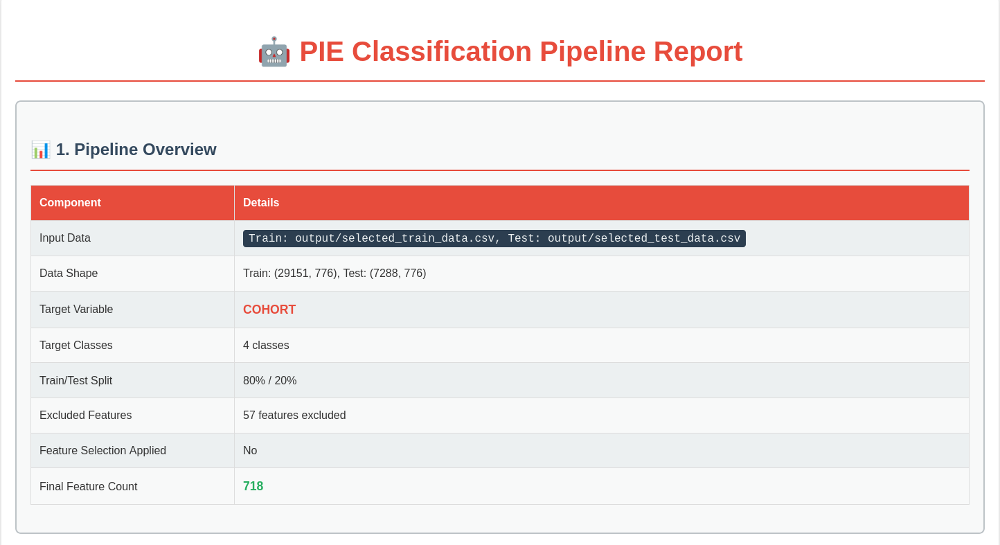
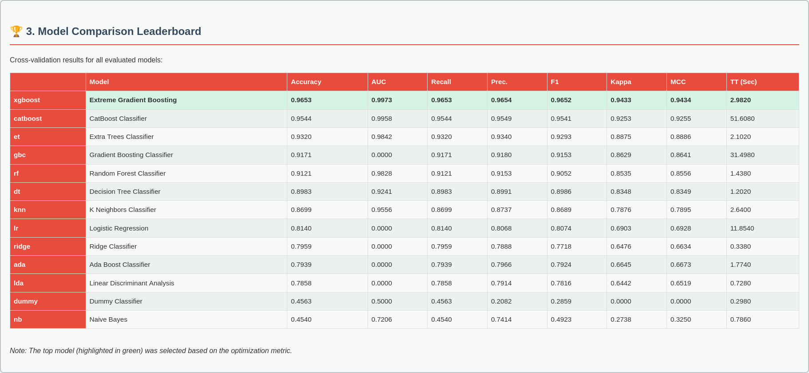
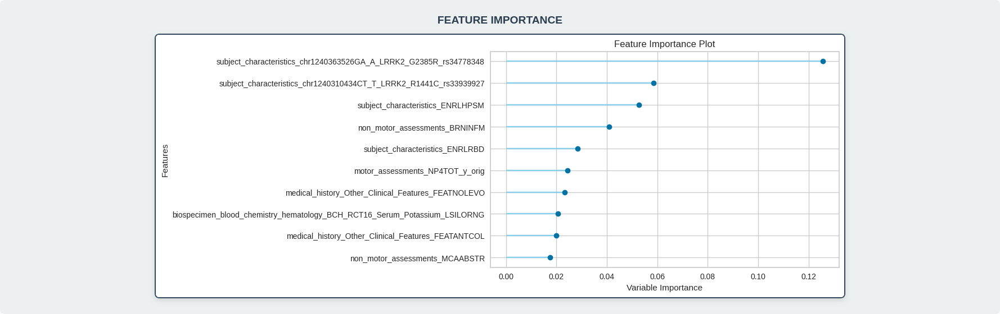
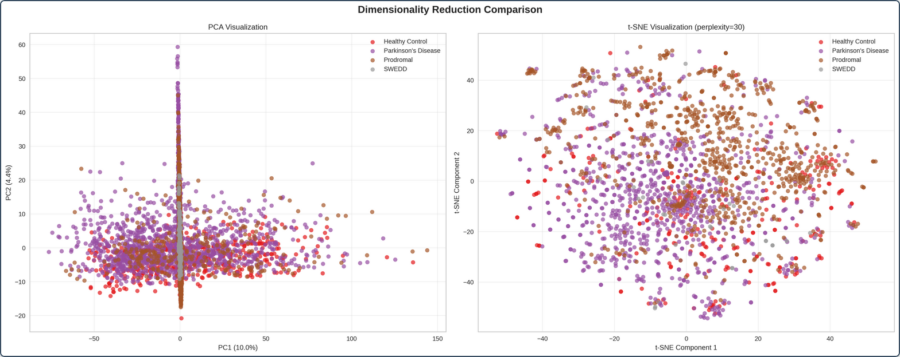
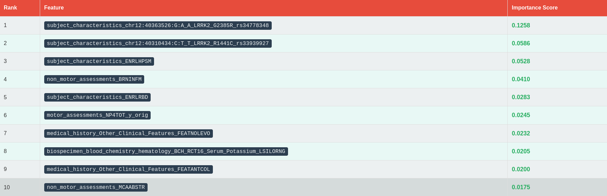
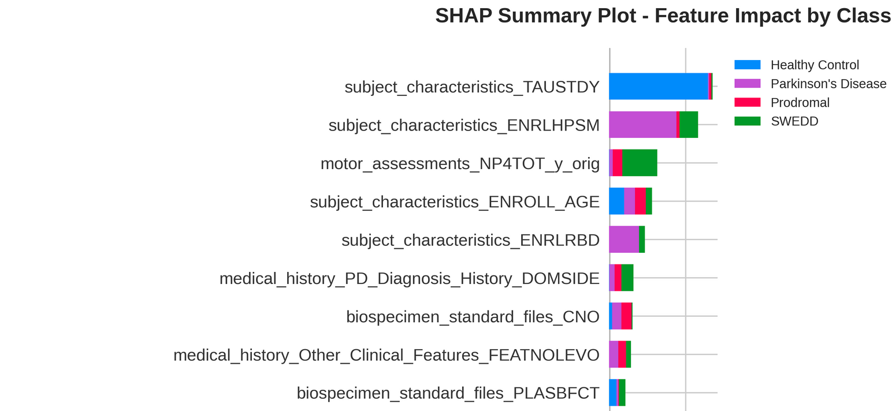

<p align="center">
  
</p>

# Parkinson's Insight Engine (PIE)

## Overview
The Parkinson's Insight Engine (PIE) is a comprehensive pipeline designed for researchers working with the Michael J. Fox Foundation's Parkinson's Progression Markers Initiative (PPMI) dataset. PIE automates the entire machine learning workflow, from loading and consolidating raw multi-modal data to training models and generating insightful reports. It provides a reproducible, configurable, and transparent framework to accelerate research.

The primary way to use PIE is through its main pipeline script, which orchestrates all the steps required to go from raw data to a full classification analysis with a single command.

## Key Features
- **End-to-End Automation**: A single command runs the full data processing and machine learning pipeline.
- **Modular Pipeline**: Each step (Data Reduction, Feature Engineering, Feature Selection, Classification) generates its own detailed HTML report and intermediate data files.
- **Intelligent Data Reduction**: Analyzes and removes low-value features *before* merging, drastically reducing memory usage and feature space complexity.
- **Robust Feature Engineering**: Applies one-hot encoding, numeric scaling, and other transformations to prepare data for modeling.
- **Advanced Model Training**: Leverages `pycaret` to compare a suite of models, tune the best performer, and evaluate its performance on a held-out test set.
- **Leakage Prevention**: Employs a configurable list of features to exclude, preventing data leakage and ensuring more realistic model evaluation.
- **Comprehensive Reporting**: Generates a main HTML report that links to detailed reports for each stage of the pipeline, providing full transparency.

## The PIE Workflow
PIE processes data in a sequential, multi-stage workflow. Each stage produces outputs that feed into the next.

```plaintext
[Raw PPMI Data]
       |
       v
[1. Data Loading]
   - Loads all raw data modalities into memory.
   - (This step is integrated into the start of the Data Reduction stage).
       |
       v
[2. Data Reduction]
   - Analyzes loaded data tables.
   - Drops low-value columns (e.g., high missingness, zero variance).
   - Merges and consolidates all tables into a single CSV.
   - (Report: data_reduction_report.html)
       |
       v
[3. Feature Engineering]
   - Applies one-hot encoding, scaling, etc. to create model-ready features.
   - (Report: feature_engineering_report.html)
       |
       v
[4. Feature Selection]
   - Splits data into training and testing sets.
   - Selects the most relevant features from the training data.
   - (Report: feature_selection_report.html)
       |
       v
[5. Classification]
   - Compares multiple ML models on the final feature set.
   - Tunes and evaluates the best model.
   - (Report: classification_report.html)
       |
       v
[Final Pipeline Report]
- (pipeline_report.html)
```

## Getting Started

### Prerequisites
- Python 3.8 or later.
- Required dependencies can be installed from `requirements.txt`:
  ```bash
  pip install -r requirements.txt
  ```

### Installation
Clone the repository and install the PIE package. For development, use the editable "`-e`" flag.
```bash
git clone https://github.com/MJFF-ResearchCommunity/PIE.git
cd PIE
pip install -e .
```

### Data Setup
1.  **Download PPMI Data**: You must [apply for access to the PPMI data](https://www.ppmi-info.org/access-data-specimens/download-data).
2.  **Organize Data**: Create a directory named `PPMI` at the root of the cloned PIE repository. Download the individual study data folders from LONI and place them inside the `PPMI` directory. The structure should look like this:
    ```plaintext
    PIE/
    ├── PPMI/
    │   ├── _Subject_Characteristics/
    │   ├── Biospecimen/
    │   ├── Motor___MDS-UPDRS/
    │   ├── Non-motor_Assessments/   
    │   ├── Medical_History/
    │   └── ... (other data folders)
    ├── pie/
    └── ... (other project files)
    ```

## How to Use PIE: The Main Pipeline

The most effective way to use PIE is by running the main pipeline script from your terminal. This script executes the entire workflow and provides configurable parameters.

### A Standard End-to-End Run
This example demonstrates a typical use case: predicting the `COHORT` of a subject.

**1. Configure Leakage Features**
Before running, it is **critical** to configure the data leakage prevention. Open `config/leakage_features.txt`. This file should contain a list of column names (one per line) that should be removed from the data because they would "leak" information about the target variable.

For example, if you are predicting `COHORT`, you should exclude features like `subject_characteristics_APPRDX` (the clinician's diagnosis), as this is nearly identical to the target. The default file provides a starting point, but you **must review and customize it for your specific research question.**

**2. Execute the Pipeline**
Run the following command from the root `PIE/` directory:
```bash
python3 pie/pipeline.py \
    --data-dir ./PPMI \
    --output-dir ./output/my_first_run \
    --target-column COHORT \
    --leakage-features-path config/leakage_features.txt \
    --fs-method fdr \
    --fs-param 0.05 \
    --n-models 5 \
    --tune \
    --budget 60.0
```

### Understanding the Command-Line Arguments
- `--data-dir`: Path to your raw PPMI data.
- `--output-dir`: Where all results, reports, and data files will be saved.
- `--target-column`: The variable you want your models to predict.
- `--leakage-features-path`: Path to your leakage prevention file.
- `--fs-method`: The feature selection algorithm to use (`fdr` or `k_best`).
- `--fs-param`: The parameter for the feature selection method (e.g., `0.05` for FDR's alpha).
- `--n-models`: The number of models to compare.
- `--tune`: A flag to enable hyperparameter tuning for the best model.
- `--budget`: A time limit in minutes for the model comparison step.

### Pipeline Output
After the run completes, the specified output directory (`./output/my_first_run`) will contain:
- **Intermediate Data**: The CSV file output from each major step.
- **HTML Reports**: A separate, detailed HTML report for each step.
- **`pipeline_report.html`**: A top-level summary report that links to all the individual step reports. The script will attempt to open this file in your browser automatically upon completion.

### Example Visualizations
The PIE pipeline generates detailed HTML reports at each stage. Here is a preview of some of the visualizations from the final classification report:

<p align="center">
  &nbsp;
  &nbsp;
  
  <br><br>
  &nbsp;
  &nbsp;
  
</p>

You can see an example of a full classification report in the image below. Click the image to view it in full size.

<p align="center">
  <a href="assets/screenshots/classification_report.png" target="_blank">
    
  </a>
</p>

## Running Tests
To verify your setup and ensure all components are working correctly, you can run the integration test. This test executes a complete, expedited run of the pipeline.

```bash
pytest tests/test_pipeline.py
```
This test will create its own output in `output/test_pipeline_run` and check that all expected files are generated and that data leakage prevention is working.

## Deeper Dive: Understanding the Modules
While the main pipeline is the recommended entry point, PIE is composed of modular components. You can learn more about each one in the detailed documentation:
- [**Data Loaders**](documentation/data_loader.md)
- [**Data Reducer**](documentation/data_reducer.md)
- [**Data Preprocessor**](documentation/data_preprocessor.md)
- [**Feature Engineer**](documentation/feature_engineer.md)
- [**Feature Selector**](documentation/feature_selector.md)
- [**Classifier & Reporting**](documentation/classifier.md)

Please also check out the notebooks directory for some great examples of how to use PIE in a more modular fashion.

## Contributing
Contributions are welcome! Please follow these steps:
1. Fork the repository.
2. Create a new branch for your feature: `git checkout -b feature-name`.
3. Make your changes.
4. Add or update tests for your changes.
5. Ensure the full test suite passes: `pytest tests/`.
6. Commit your changes and create a pull request.

## Contributors
- Cameron Hamilton
- Victoria Catterson

## License
This project is licensed under the MIT License. See the `LICENSE` file for details.

## Contact
If you have any questions or suggestions, please don't hesitate to contact Cameron@AllianceAI.co.
