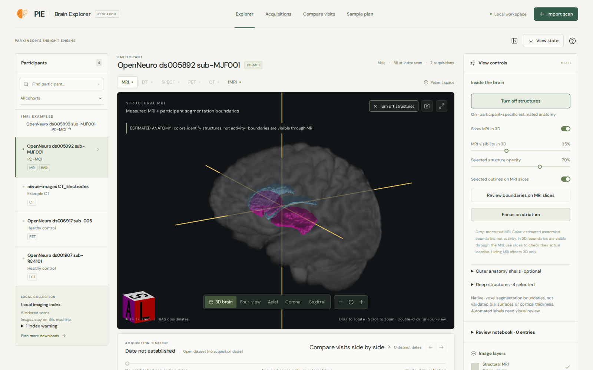
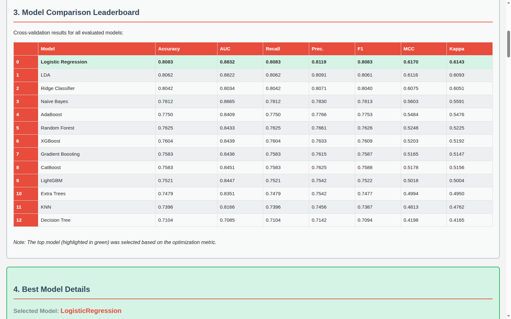
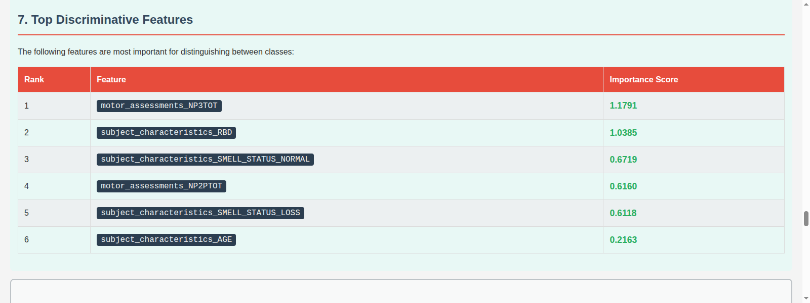
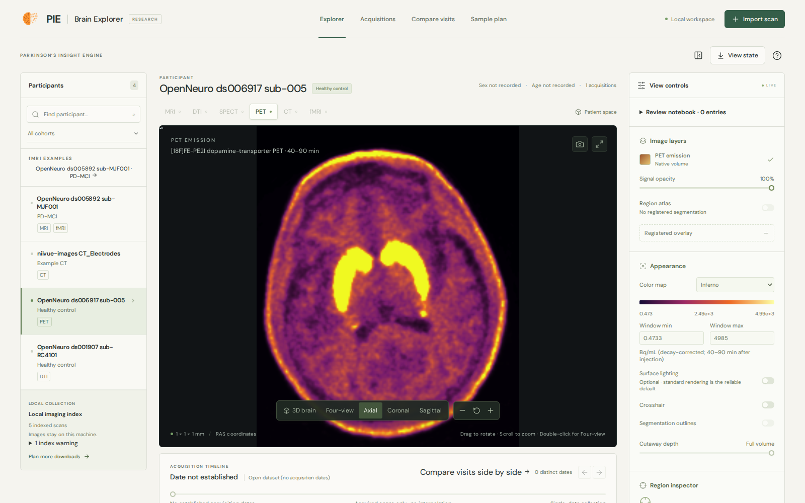
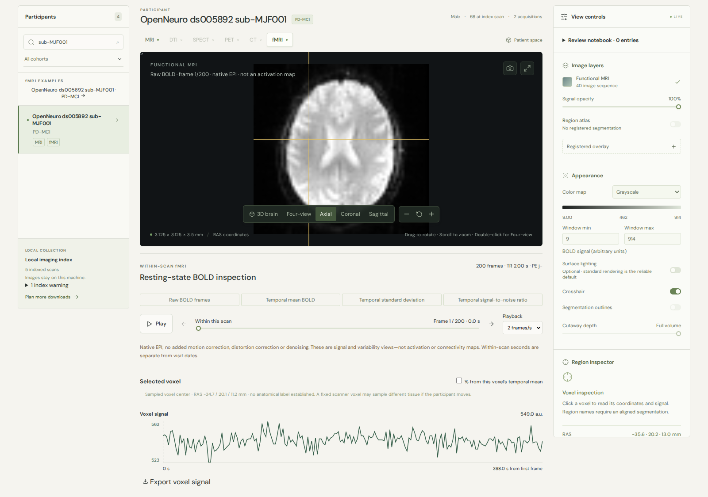

<p align="center">
  
</p>

# Parkinson's Insight Engine (PIE)

PIE is a Python toolkit for research on data from the Michael J. Fox Foundation's
[Parkinson's Progression Markers Initiative (PPMI)](https://www.ppmi-info.org/). It covers the
path from the raw PPMI download to a result you can defend.

| Layer | What it does | Docs |
|---|---|---|
| **Tabular ML pipeline** | Loads and cleans every PPMI study table, drops low-value columns, merges, engineers and selects features, then compares, tunes and reports classifiers. One command runs it all. | [pipeline](documentation/pipeline.md) |
| **Statistics** | Classical tests, regression, mixed models, survival analysis, multiple-testing correction, small-sample tools (bootstrap partial correlation, feature-subset search nested inside the validation folds), and PD helpers (LEDD, MDS-UPDRS totals, Hoehn & Yahr). Results come back as plain dictionaries. | [stats](documentation/stats.md) |
| **Experiments** | Cohort rules for PPMI's encoding traps, nested model selection that never sees its test partition, and provenance manifests. | [experiment](documentation/experiment.md) |
| **Imaging** | LONI DICOM → NIfTI → imaging-derived phenotypes: FastSurfer volumes with head-size adjustment, diffusion free water, JHU tract FA and MD, neuromelanin contrast and volume, DaTscan binding ratios and FLAIR lesions. Keyed by `PATNO`/`EVENT_ID`, so they join the tabular data. | [imaging](documentation/imaging.md) |
| **fMRI** | BIDS export, fMRIPrep, motion QC, parcel connectivity, striatal seeds, and the basal ganglia network from group ICA with dual regression. | [fMRI](documentation/fmriprep.md) |
| **Brain Explorer** | A local browser viewer for MRI, DTI, SPECT, PET, CT and fMRI, with 3-D anatomy, linked slices and visit comparison. | [viewer](documentation/brain_viewer.md) |

PIE contains no PPMI data. [Apply for access](https://www.ppmi-info.org/access-data-specimens/download-data)
and download the data yourself. Loading and cleaning the tabular data is done by the companion package
[PIE-clean](https://github.com/MJFF-ResearchCommunity/PIE-clean), which PIE installs. Use PIE-clean
on its own if you only want to explore the data.

<p align="center">
  
</p>

*Brain Explorer on open data: T1 MRI of a person with Parkinson's disease and mild cognitive
impairment, with FastSurfer's caudate and putamen (OpenNeuro ds005892, CC0). See
[Quick start 5](#5-explore-brains-in-3-d) to reproduce it.*

## Installation

PIE needs Python 3.10 or newer. The imaging layer pins FastSurfer's scientific stack, so it
lives in a second environment.

```bash
git clone https://github.com/MJFF-ResearchCommunity/PIE.git
cd PIE
python -m venv venv && source venv/bin/activate
pip install -r requirements.txt     # includes PIE-clean
pip install -e .
```

Optional extras:

```bash
bash scripts/setup_imaging.sh        # imaging venv (venv_imaging) with FastSurfer; pass "cpu" without a GPU
venv_imaging/bin/python -m pip install -r pie/imaging/viewer/requirements.txt   # Brain Explorer backend
npm --prefix brain-viewer ci         # Brain Explorer frontend (Node.js 18+)
```

[Environments](documentation/README.md#environments) explains which layer runs where.

## PPMI data layout

Download the study data and, if you need them, the image collections from LONI. Place them at the
repository root. Both folders are gitignored.

```plaintext
PIE/
├── PPMI/                                   # study-data download
│   ├── _Subject_Characteristics/
│   ├── Biospecimen/
│   ├── Medical_History/
│   ├── Motor___MDS-UPDRS/
│   ├── Non-motor_Assessments/
│   └── ...
└── Imaging/                                # optional: LONI image collections
    ├── MRI_First_Study.zip
    ├── MRI_First_Study_dataset.zip
    ├── MRI_First_Study_9_07_2026.csv       # the collection's search-result CSV
    └── MRI_First_Study_IDA_Metadata.zip
```

## Quick start

### 1. Run the tabular pipeline

```bash
python pie/pipeline.py --data-dir ./PPMI --output-dir output/pd_vs_hc --target-column COHORT \
    --fs-method fdr --fs-param 0.05 --n-models 3 --tune --budget 60
```

```plaintext
PPMI/ ─► 1. load + reduce ─► 2. feature engineering ─► 3. feature selection ─► 4. classification
            (PIE-clean)          encode, scale             split by participant,    compare, tune,
                                                            refit on train, select   score held-out test
```

The split is stratified by class and grouped by `PATNO`, so no participant appears on both
sides. Scaling, imputation, cross-validation folds and tuning folds all respect that split.

Each stage writes its data file and an HTML report to `--output-dir`, and `pipeline_report.html`
links them all. Before a real run, review `config/leakage_features.txt`. It lists the columns
that would leak the target (for example, the clinician's diagnosis when you are predicting
`COHORT`), and the right list depends on your question. [Pipeline](documentation/pipeline.md)
documents every flag and output.

<p align="center">
  
  
</p>

*`classification/classification_report.html` at the end of a run: every model compared on the
training split, then the features that separated the classes. Further down it also gives the
confusion matrix, a SHAP summary and the held-out test scores. This run used synthetic data, not
PPMI, so the numbers illustrate the format rather than any real result.*

Prefer a notebook? [`walkthroughs/basic_classification.ipynb`](walkthroughs/basic_classification.ipynb)
runs the same analysis stage by stage, inspecting the frame between steps.

### 2. Test a hypothesis

```python
import numpy as np
from pie import stats

rng = np.random.default_rng(1)
pd_group, hc_group = rng.normal(28, 10, 60), rng.normal(4, 3, 40)   # synthetic motor scores

r = stats.welch_ttest(pd_group, hc_group)
r["p_value"], r["cohens_d"]

stats.compute_ledd({"levodopa_ir": 300, "pramipexole": 1.5, "rasagiline": 1,
                    "entacapone": 600})["total_ledd_mg"]    # 649.0: entacapone adds 0.33 × levodopa
```

See [Statistics](documentation/stats.md), which includes a "which test do I use?" table.

### 3. Build a cohort you can defend

```python
import tempfile
from pathlib import Path
import pandas as pd
from pie.experiment import cohort, provenance

demographics = pd.DataFrame({"PATNO": [1, 1, 2, 3, 3], "SEX": [1, 1, 0, 1, 2],
                             "PAG_NAME": ["SCREEN", "PARTICIPANT_PROFILE", "SCREEN",
                                          "SCREEN", "PARTICIPANT_PROFILE"]})
demographics["sex_male"] = cohort.decode_sex(demographics)   # PPMI codes SEX differently per module
sex_male = cohort.unique_per_participant(demographics, "sex_male")
sex_male.to_dict()                                           # {1: 1.0, 2: 0.0}: PATNO 3's records disagree

run = Path(tempfile.mkdtemp())
sex_male.to_csv(run / "cohort.csv")
provenance.write_manifest(run, inputs=[run / "cohort.csv"], code=Path("pie/experiment"), seed=20260913)
provenance.verify_manifest(run)                              # [] while inputs and outputs are unchanged
```

`pie.experiment.prediction.nested_fold` runs model selection whose imputation, scaling and PCA
are fitted only on training participants. See [Experiment](documentation/experiment.md).

### 4. Turn MRI into features

```bash
venv_imaging/bin/python -m pie.imaging.run \
    --zips Imaging/MRI_First_Study.zip Imaging/MRI_First_Study_dataset.zip \
    --ppmi-dir PPMI --work-dir Imaging/derived \
    --loni-csv Imaging/MRI_First_Study_9_07_2026.csv --ida-metadata Imaging/MRI_First_Study_IDA_Metadata.zip

python pie/pipeline.py --data-dir ./PPMI --imaging-features Imaging/derived/fastsurfer_idps.csv ...
```

Diffusion, neuromelanin and DaTscan have their own runners, described in
[Imaging](documentation/imaging.md), [DWI](documentation/imaging_dwi.md) and
[NM and DaTscan](documentation/imaging_nm_datscan.md). For resting-state fMRI, see
[fMRI processing](documentation/fmriprep.md). Each page also documents the measures that match the
published imaging literature — JHU tract FA, neuromelanin volume, tissue volumes and the basal
ganglia network — and [Imaging](documentation/imaging.md) tabulates how they line up.

Check a measure before you model with it. Look at the QC overlays (`pie.imaging.qc`)
and registration checks, and test the measure against something it should track that is not your outcome, such as
age or Parkinson's disease against controls. A feature can look plausible and still come from a
mask in the wrong place. [Measurement safeguards](documentation/imaging.md#measurement-follow-up-safeguards-september-2026)
lists the checks PIE runs for you and the ones it leaves to your study.

Notebook: [`walkthroughs/imaging_features.ipynb`](walkthroughs/imaging_features.ipynb) walks the
whole path, from the LONI download to IDPs joined to the pipeline.

### 5. Explore brains in 3-D

You can try the Brain Explorer without PPMI access. The fetch script downloads openly licensed
scans (about 220 MB, SHA-256 verified) and writes a viewer manifest:

```bash
venv_imaging/bin/python scripts/fetch_viewer_examples.py        # download, verify, write Imaging/examples/manifest.json
# optional: segment the T1 with FastSurfer for 3-D structures (the script prints the exact command), then re-run it
venv_imaging/bin/python -m pie.imaging.viewer serve --manifest Imaging/examples/manifest.json
# open http://127.0.0.1:8765
```

<p align="center">
  
  
</p>

*Left: [18F]FE-PE2I dopamine-transporter PET of a healthy control (OpenNeuro ds006917, CC0). It
is not DaTscan and not a patient. Right: resting BOLD from a person with Parkinson's disease and
mild cognitive impairment (OpenNeuro ds005892, CC0).*

The example set also includes a T1 with FastSurfer structures from that same participant, a DTI
example from a healthy older control, and a head CT. [Brain Explorer](documentation/brain_viewer.md)
documents the attributions, PIE's own outputs, imports, fusion rules and the HTTP API.

Notebook: [`walkthroughs/brain_viewer.ipynb`](walkthroughs/brain_viewer.ipynb) demonstrates the
viewer on the open data above, then shows the same viewer reading your PPMI outputs.

## Documentation

Start at the [documentation index](documentation/README.md). It maps every module to its page,
lists the test commands, and gives the rules for data in examples.

## Data privacy

PPMI data is released under a data use agreement. Never commit participant IDs (`PATNO`
values), LONI image IDs or participant-level records, whether in code, docs, tests or
screenshots. Summary statistics and PPMI file names are fine. Examples use synthetic data.

## Publishing with PPMI data

PPMI's [publication policy](https://www.ppmi-info.org/sites/default/files/docs/ppmi-publication-policy.pdf)
applies to anything you publish from the data, whatever software you used. Manuscripts go to the
PPMI Data and Publications Committee before journal submission, and must carry PPMI's
acknowledgement text with your download date and `RRID:SCR_006431`. Record the download date when
you download. `provenance.write_manifest(..., ppmi_download="2000-01-01")` keeps it with the run.

## How to cite

If PIE contributes to your work, please cite it, and give the commit or release you ran:

> Hamilton, C. R., Catterson, V. & Michael J. Fox Foundation Research Community Data Modality and
> Methodology Task Force. Parkinson's Insight Engine (PIE): an imaging and analysis library for the
> Parkinson's Progression Markers Initiative. GitHub https://github.com/MJFF-ResearchCommunity/PIE (2026).

GitHub's **Cite this repository** button gives the same entry in BibTeX and APA, from
[`CITATION.cff`](CITATION.cff). PIE wraps other people's tools, including FastSurfer, fMRIPrep, ANTs
and DIPY. Please cite the ones your analysis ran.

## Contributing

1. Fork the repository and create a branch: `git checkout -b feature-name`.
2. Make your change, with tests.
3. Run the relevant suites (see [Tests](documentation/README.md#tests)).
4. Open a pull request. Keep PPMI data out of it.

## Contributors
- Cameron Hamilton
- Victoria Catterson
- Amgad Droby
- Elizabeth Hutchins

## License
MIT. See [LICENSE](LICENSE).

## Contact
Questions and suggestions: Cameron@AllianceAI.co.
