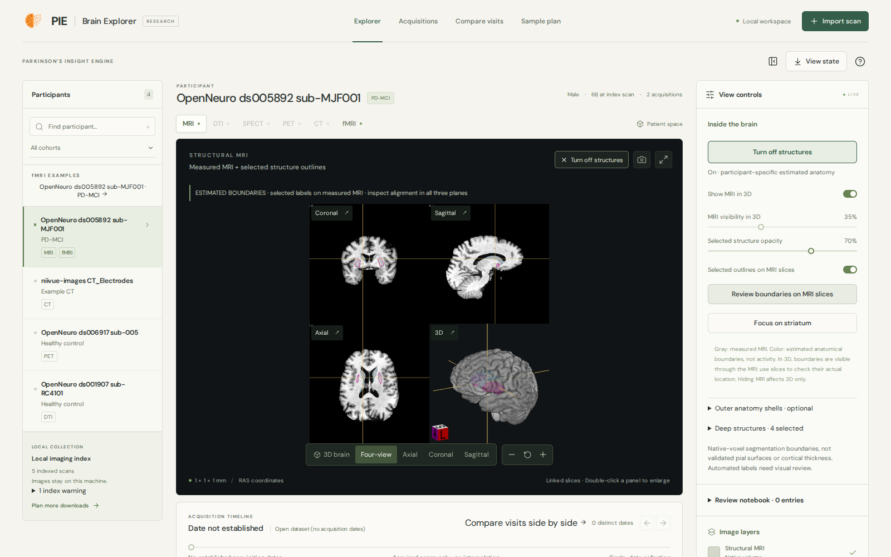
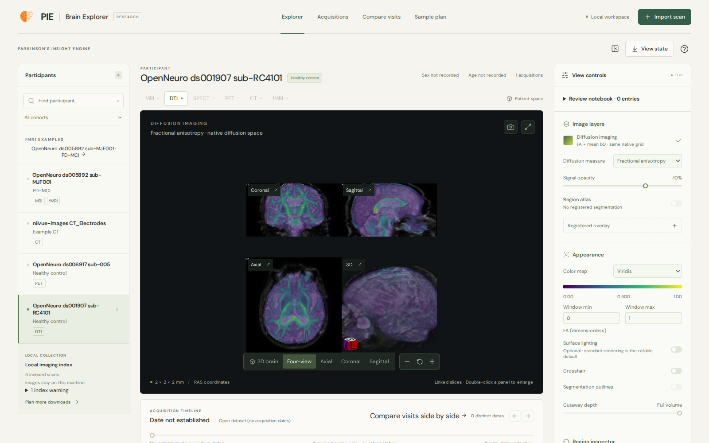
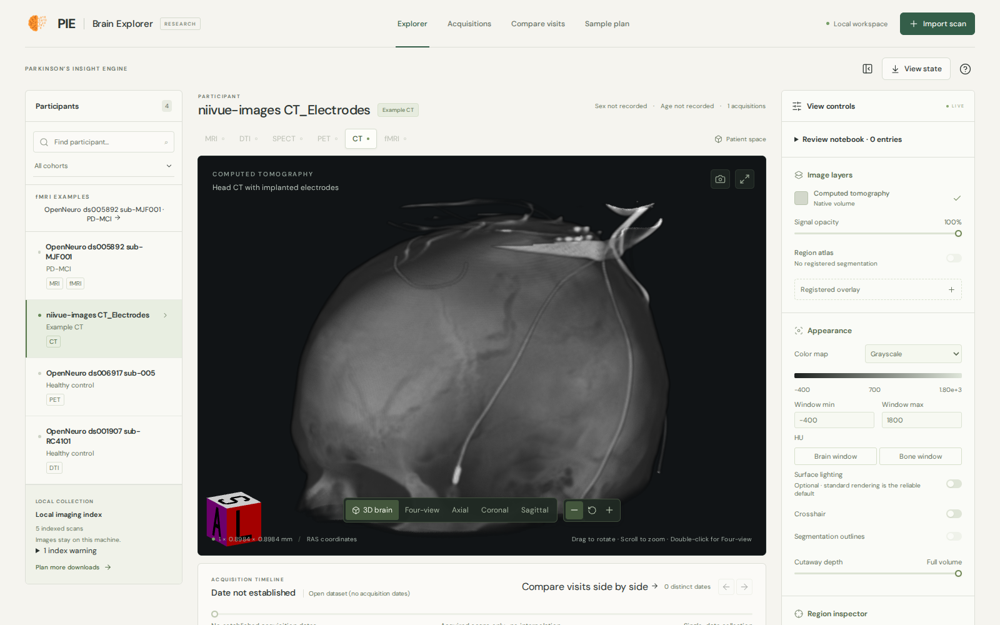

# PIE Brain Explorer

A local, single-user workstation for participant-specific neuroimaging: 3D volume
rendering, linked slices, regional segmentation, acquisition-date navigation and
explicitly registered overlays. The browser renders with
[NiiVue](https://niivue.com/docs/); a FastAPI service reads finished PIE products and
explicit manifests. No image leaves the machine, no template brain stands in for a
participant, and no geometry is generated.

```
Imaging/derived/* ─┐
PPMI status table ─┼─ catalog.py ──► /api/catalog  (+ warnings for anything missing)
manifest.json ─────┘      │
                          └─ images.py / anatomy.py / structures.py / comparison.py / fmri.py
                               │  (prepared copies in the viewer cache)
                               └──► /api/scans/... ──► brain-viewer/ (React + NiiVue)
```

Nothing PPMI-specific is required. With no `PPMI/` and no `Imaging/` folder the server
starts, reports what it could not find as warnings, and serves whatever a manifest
lists (see [Non-PPMI data](#non-ppmi-data)).

| Module | What it does |
|---|---|
| `server.py` | FastAPI app: API routes, loopback-only host check, security headers, serves `brain-viewer/dist`. |
| `__main__.py` | CLI: `serve` (default) and `sample-plan`. |
| `catalog.py` | Discovers finished MRI/DTI/SPECT outputs, loads and validates a manifest, merges prepare-script manifests, finds the newest dated PPMI table. Never accepts paths over HTTP. |
| `images.py` | Geometry-preserving preparation (MGZ→NIfTI, masking, label atlases), window estimates, region tables, asset IDs. |
| `anatomy.py` | Unreviewed SPECT-in-MRI preview from a pipeline row that names its exact MRI reference. |
| `structures.py` | GIFTI boundary meshes of DKT/aseg labels in scanner RAS. |
| `comparison.py` | Unreviewed 6-DOF rigid alignment of a follow-up MRI into baseline geometry. |
| `fmri.py` | Descriptive BOLD summaries (temporal mean/SD/tSNR, foreground trace, raw DVARS). See [fMRI inspection](fmri_viewer.md). |
| `sample_plan.py` | Evidence-backed IDA download shortlist from local PPMI tables. |
| `atlas.tsv` | DKT + aseg label names/colours; provenance in `ATLAS_NOTICE.md`. |

## Try it with open data

Four openly licensed participants, no PPMI access needed: about 220 MB of downloads,
plus a FastSurfer run for the 3-D structures.

```bash
# once: viewer deps and frontend build (scripts/setup_imaging.sh clones FastSurfer into third_party/)
venv_imaging/bin/python -m pip install -r pie/imaging/viewer/requirements.txt
npm --prefix brain-viewer ci && npm --prefix brain-viewer run build

# 1. fetch: download, verify SHA-256, derive display copies, write Imaging/examples/manifest.json
venv_imaging/bin/python scripts/fetch_viewer_examples.py

# 2. segment the ds005892 T1 for 3-D structures (CPU, about 20 min; step 1 prints this with your paths)
R=$PWD; (cd third_party/FastSurfer && ./run_fastsurfer.sh \
  --t1 "$R/Imaging/examples/ds005892/sub-MJF001_T1w.nii.gz" --sid ds005892_sub-MJF001 \
  --sd "$R/Imaging/examples/fastsurfer" --seg_only --no_cereb --no_hypothal --no_cc \
  --device cpu --viewagg_device cpu --threads 6 --py "$R/venv_imaging/bin/python")
venv_imaging/bin/python scripts/fetch_viewer_examples.py      # again: adds the T1 + structures entry

# 3. serve, then open http://127.0.0.1:8765
venv_imaging/bin/python -m pie.imaging.viewer serve --manifest Imaging/examples/manifest.json
```

Everything lands in the gitignored `Imaging/examples/`, with `ATTRIBUTION.md` beside
the data. Re-running skips files that already verify. `--no-dwi` skips the diffusion
example (67 MB plus a few minutes of tensor fitting). Segmentation-only FastSurfer needs
no FreeSurfer licence. If this checkout also holds PIE's PPMI outputs, they are indexed
alongside the examples.

Who the data come from:

- **sub-MJF001** (OpenNeuro ds005892): a 68-year-old man with Parkinson's disease and
  mild cognitive impairment (PD-MCI), from an MJFF-funded study. The T1, structures
  and BOLD views are his.
- **sub-005** (ds006917): a healthy control. [18F]FE-PE2I is a dopamine-transporter
  PET tracer, the closest open stand-in for DaTscan. This is PET of a healthy brain:
  not SPECT, not Parkinson's, not an abnormal scan.
- **sub-RC4101** (ds001907): a healthy older control (the dataset's RC41* group).
- **CT_Electrodes** (niivue-images): a head CT with implanted electrodes; its clinical
  context is not stated.

| Sidebar entry | Loaded as | Try |
|---|---|---|
| OpenNeuro ds005892 sub-MJF001 · PD-MCI | MRI (T1 with FastSurfer mask and DKT + aseg labels) and fMRI (200 × 2 s resting BOLD) | **Show MRI + structures**, **Focus on striatum**, **Review boundaries on MRI slices**; then **fMRI**, click a voxel in a slice, **Play** |
| OpenNeuro ds006917 sub-005 · Healthy control | PET, 1 mm, Bq/mL | **Four-view**, click the striatum, adjust the window |
| OpenNeuro ds001907 sub-RC4101 · Healthy control | DTI: FA over mean b0, plus MD | **Diffusion measure**, **Four-view** |
| niivue-images CT_Electrodes | CT, HU | **Bone window**, rotate in 3-D |

**Compare visits** is not part of the demo: none of these examples has two dated MRIs
of one participant.


*sub-MJF001 (PD-MCI): brain-masked T1 at 35% opacity with his FastSurfer caudate and
putamen boundaries. Estimated segmentation, not a validated surface.*


*Same participant: linked Four-view with the selected striatal outlines drawn on the
measured slices.*


*Same participant's resting BOLD: one frame of 200, the playback transport and a
fixed-voxel trace. Unprocessed signal, not an activation map.*

![PET: [18F]FE-PE2I dopamine-transporter uptake in a healthy control, axial slice through the striatum](../assets/screenshots/brain_viewer_pet.png)
*Healthy control, [18F]FE-PE2I PET, 40–90 min, Bq/mL: dopamine-transporter uptake
concentrates in the striatum. Not DaTscan, not a patient.*


*Healthy older control: FA over the motion-corrected mean b0, computed with
`pie.imaging.dwi`.*


*Head CT with implanted electrodes, bone window. MIT-licensed example; clinical context
not stated.*

## Install

From the repository root. `pie` is not installed into the environment; every
`python -m pie...` command below must be run from the repo root.

```bash
python3 -m venv venv_imaging                     # skip if the imaging env exists
venv_imaging/bin/python -m pip install -r pie/imaging/viewer/requirements.txt
npm --prefix brain-viewer ci                     # Node.js 18+ (Vite 6)
```

`requirements.txt`: fastapi, uvicorn, nibabel, numpy, scipy, scikit-image, SimpleITK,
pandas, httpx (httpx is only for the API tests). The API needs no GPU. Rendering needs
WebGL2: a current Chrome/Chromium or Firefox with hardware acceleration.

The `prepare_viewer_*` scripts additionally need `dcm2niix` at
`venv_imaging/bin/dcm2niix` (`pie.imaging.convert.DCM2NIIX`).

## Run

```bash
bash scripts/run_brain_viewer.sh            # build frontend, serve on http://127.0.0.1:8765
bash scripts/run_brain_viewer.sh --ppmi-dir /path/to/PPMI --cache-dir /mnt/viewer-cache --require-cache-mount
```

`run_brain_viewer.sh` checks the Python imports, runs `npm ci` if
`brain-viewer/node_modules` is missing, and always runs `npm run build`. It then runs
`python -m pie.imaging.viewer sample-plan --if-missing "$@"`, then
`exec python -m pie.imaging.viewer serve "$@"`. Both commands get the same arguments,
so `--repo`, `--ppmi-dir` and `--output` shape the sample plan and the server alike.
The plan is built only when `<output>/plan.json` does not exist yet.

| Env var | Default | Effect |
|---|---|---|
| `PIE_VIEWER_PYTHON` | `venv_imaging/bin/python` | Interpreter used by `run_brain_viewer.sh`. |
| `PIE_VIEWER_API_PORT` | `8765` | API port the Vite dev server proxies `/api` to. Must be 1–65535. |

Development, in two terminals (hot reload on http://127.0.0.1:5178):

```bash
venv_imaging/bin/python -m pie.imaging.viewer serve --port 8766
PIE_VIEWER_API_PORT=8766 npm --prefix brain-viewer run dev
```

The dev port is fixed at 5178 (`strictPort`). `vite.config.ts` reads
`PIE_VIEWER_API_PORT` through `src/apiTarget.ts`. The same value appears in the dev
page's "service unavailable" message, so that message names the port actually being
proxied.

| npm script | Command | Use |
|---|---|---|
| `dev` | `vite --host 127.0.0.1` | Dev server with `/api` proxy. |
| `build` | `tsc -b && vite build` | Typecheck and write `brain-viewer/dist` (gitignored). |
| `preview` | `vite preview --host 127.0.0.1` | Serve the built bundle through Vite; not needed in production. |
| `test` | `vitest run` | Frontend unit tests. |

In production, `serve` mounts `<repo>/brain-viewer/dist` at `/` when it exists; without
a build only the API answers. Restart the API after changing a manifest or finishing
more processing: the catalog is read once at startup. Index warnings are logged at
startup (`Viewer index: ...`).

### `python -m pie.imaging.viewer`

```
python -m pie.imaging.viewer [serve|sample-plan] [--repo REPO] [--ppmi-dir DIR]
    [--manifest JSON] [--cache-dir DIR] [--require-cache-mount] [--port N]
    [--output DIR] [--if-missing]
```

| Flag | Default | Applies to | Meaning |
|---|---|---|---|
| `command` | `serve` | — | `serve` the API/frontend, or build the `sample-plan`. |
| `--repo` | this checkout | both | Root containing `Imaging/`, `brain-viewer/dist`, `documentation/`. It need not exist. |
| `--ppmi-dir` | `<repo>/PPMI` | both | PPMI study-data root (participant status, acquisition tables). Optional. |
| `--manifest` | `<repo>/Imaging/derived/viewer_collection/manifest.json` if present | `serve` | One explicit manifest. Replaces the automatic collection manifest; only one manifest is ever loaded. A path that does not exist is an error. |
| `--cache-dir` | `<repo>/Imaging/derived/viewer_cache` | `serve` | Where prepared viewer copies are written. |
| `--require-cache-mount` | off | `serve` | Refuse to start unless `--cache-dir` is given and is a mount point; return 503 on `/api/*` if it disappears. |
| `--port` | `8765` | `serve` | Listen port. The host is always `127.0.0.1`. |
| `--output` | `<repo>/Imaging/derived/viewer_sample_plan` | both | Sample-plan folder: `sample-plan` writes it, `serve` reads `plan.json` from it. |
| `--if-missing` | off | `sample-plan` | Keep an existing `plan.json` instead of rebuilding. |

Startup problems (an invalid manifest, a cache mount that is required but missing)
exit with status 2 and one line, `PIE Brain Explorer: <reason>`, instead of a traceback.

**Why the cache flags exist.** Prepared copies (MGZ conversions, masked volumes, label
atlases, meshes, comparison resamples, BOLD summaries) can be large. `--cache-dir`
moves only these; sources, experiment scratch and scientific derivatives stay where
they are. `--require-cache-mount` is for a dedicated, capacity-limited volume: without
it, an unmounted mount point is an ordinary directory on the parent disk and would fill
it silently. It therefore requires an explicit `--cache-dir` and never assumes the
default. The flags neither mount, format nor impose a quota; provision the volume
outside PIE. A full volume surfaces as a preparation error. Nothing is evicted.

### Local-only by construction

- Binds `127.0.0.1` only; there is no authentication layer.
- `TrustedHostMiddleware` accepts only `127.0.0.1`, `localhost` and `[::1]`, so a DNS
  rebinding page cannot read local images (other `Host` headers get 400). An SSH tunnel
  that forwards to `localhost` still works.
- Every response has `X-Content-Type-Options: nosniff` and `Referrer-Policy: no-referrer`;
  `/api/*` responses are `Cache-Control: no-store`.
- File access is by opaque asset ID (SHA-256 of the resolved path). An asset is served
  only after its scan has been prepared in this process. There is no path parameter.

## Data it reads

Discovery is read-only and reads only these finished products. It does not recurse
into intermediate or failed runs. Every source is optional. A missing one becomes a
warning in `/api/catalog` and the participant sidebar, never an exception.

| Source | Path (relative to `--repo` unless noted) | Used for |
|---|---|---|
| Participant status | `<ppmi-dir>/_Subject_Characteristics/Participant_Status_<date>.csv` (`PATNO`, `COHORT_DEFINITION`) | Current cohort. |
| MRI sessions | `Imaging/derived/sessions.csv` (`patno`, `image_id`, `series_desc`; optional `ida_*`/`loni_*`, `EVENT_ID`, `session_date`) | One MRI scan per row with finished FastSurfer output. |
| FastSurfer | `Imaging/derived/fastsurfer/<image_id>/mri/orig_nu.mgz` (else `orig.mgz`), `mask.mgz`, `aparc.DKTatlas+aseg.deep.mgz` | MRI image, brain mask, DKT + aseg atlas. |
| Diffusion | `Imaging/derived/dwi/dwi_index.csv` (`patno`, `image_id`, `date`, `selected`) and `Imaging/derived/dwi/<patno>/{fa,b0,md,fw,fat,aseg_dwi}.nii.gz` | DTI scan (FA over mean b0, MD/FW/FAt as extra measures). |
| SPECT (native) | `Imaging/derived/datscan_v5/datscan_sbr.csv` (`patno`, `image_id`, `nifti`, `error`, …) | Reconstructed DaTscan volume. |
| SPECT dates | `Imaging/First_Study_SPECT_<date>.csv`, the IDA collection CSV (`Image Data ID`, `Acq Date`, `Visit`) | SPECT acquisition date/visit. |
| SPECT preview | `Imaging/derived/datscan_full/datscan_sbr.csv` (`image_id`, `fs_image_id`, `patno`, `nifti`, `flip_lr`, `reg_params`, `reg_center`, `error`) | MRI + SPECT alignment preview. |
| Collection manifest | `Imaging/derived/viewer_collection/manifest.json` | Loaded automatically unless `--manifest` is given. |
| Sample plan | `<output>/plan.json` (default `Imaging/derived/viewer_sample_plan/`) | **Sample plan** tab. |
| Download checklist | `documentation/viewer_next_downloads.md` (optional, gitignored) | `/api/download-guide` and the tab's checklist button. |

**Dated PPMI tables.** PPMI re-releases tables with the download date in the file name,
e.g. `Participant_Status_08Sep2026.csv` or `First_Study_SPECT_9_07_2026.csv`. For each
table stem, `catalog.latest_table` picks the newest release. After the stem it accepts
an undated `<stem>.csv` or a suffix in one of four date forms: `_08Sep2026`,
`_9_07_2026` (M_DD_YYYY), `_2026-09-08` or `_20260908`. Equal dates fall back to file
modification time. Any other suffix (`CT_Scan_notes.csv`) is ignored, so a new download
is picked up without a code change, and an unrelated file is never mistaken for the table.

Rules that shape what appears:

- A participant enters the PIE index through a finished MRI. DTI and SPECT rows for a
  participant with no finished MRI are skipped and counted in a warning.
- The diffusion pipeline keeps one selected session per participant. Its date is
  attached only when all selected index rows agree; otherwise it is "Date not established".
- SPECT rows with an `error`, or whose NIfTI is missing, are skipped and counted.
- Dates are kept only at day precision (`YYYY-MM-DD` or `MM/DD/YYYY`, years
  1900–2100). Masked or month-only dates become null. The viewer never invents one.
- Archive group (`ida_group`/`loni_group`) and current cohort (`COHORT_DEFINITION`)
  are stored and shown separately, because they are different concepts. Without the
  status table, cohort falls back to the archive group.
- Discovered participants carry `collection: "PPMI"`, which the UI shows as the label
  prefix ("PPMI" followed by the PATNO).

Warnings the index can report: no `Imaging/derived` at all (manifest scans only); no
`sessions.csv`; no status table (reported only if there are MRI sessions); sessions
without a finished FastSurfer image; no `dwi_index.csv`; diffusion participants
skipped; no `datscan_sbr.csv`; no SPECT dates table (reported only if there are SPECT
rows); SPECT rows skipped. Counts are reported, not per-row lists.

Scan IDs: `mri-<image_id>`, `dti-<patno>`, `spect-<image_id>`, manifest IDs as given.
The catalog puts participants with the most modalities first, then orders by numeric ID.
For scale: a full local PPMI index was about 1,800 participants and 3,050 scans (a
snapshot of the September 2026 downloads). The sidebar lists at most 70 matches, so
use search.

### Viewer cache

Everything prepared is written under the cache directory (default
`Imaging/derived/viewer_cache/`, gitignored), in folders keyed by a SHA-256 of the
scan's public record plus every source file's path, mtime and size. Editing a source
therefore invalidates its cache entry. Old entries are not deleted.

| Folder | Contents |
|---|---|
| `<key>/` | `image.nii.gz` (only for MGZ or masked sources), `anatomy.nii.gz`, `atlas.nii.gz` (uint16, label intent), `regions.json`, `bold_{mean,sd,tsnr}_v1.nii.gz`, `bold_summary_v1.json` |
| `anatomy-v1-<key>/` | `spect_in_mri_preview.nii.gz` |
| `structures-<key>/` | `structure-<group>.surf.gii`, `structures.json` |
| `comparison-<key>/` | `followup_in_baseline.nii.gz`, `registration.json` |

A NIfTI that needs neither conversion nor masking is served directly from its source.

## Import manifest

For persistent imports, overlays, segmentations, tractography, non-PPMI data, or
anything over the browser's 512 MB limit. Keep it outside version control. Relative
paths resolve against the manifest's directory. The example uses synthetic IDs and dates.

```json
{
  "version": 1,
  "subjects": [
    {"id": "P001", "collection": "Local", "group": "Imported", "cohort": "Imported", "sex": "F", "age_at_scan": "60"}
  ],
  "scans": [
    {
      "id": "p001-t1-baseline",
      "subject": "P001",
      "modality": "MRI",
      "date": "2000-01-01",
      "visit": "Baseline",
      "description": "T1-weighted anatomical MRI",
      "path": "images/T1w.nii.gz",
      "mask": "images/brain_mask.nii.gz",
      "atlas": "images/labels.nii.gz",
      "atlas_name": "Participant segmentation",
      "atlas_lut": "images/labels.tsv",
      "space": "sub-P001:baseline-T1",
      "units": "arbitrary intensity",
      "provenance": "Source acquisition and preprocessing"
    },
    {
      "id": "p001-pet-in-t1",
      "subject": "P001",
      "modality": "PET",
      "date": "2000-01-02",
      "path": "images/PET_in_T1w.nii.gz",
      "space": "sub-P001:baseline-T1",
      "registration": "verified",
      "reference_id": "p001-t1-baseline",
      "tracer": "18F-FDG",
      "units": "SUV (body-weight normalized)",
      "provenance": "Calibration, transform, registration software and visual QC"
    }
  ]
}
```

Scan fields are exactly the `catalog.Scan` fields:

| Field | Default | Notes |
|---|---|---|
| `id` | required | Unique across the manifest and discovered scans. |
| `subject` | required | Coerced to string. Creates an `Imported` subject if not listed. |
| `modality` | required | `MRI`, `DTI`, `SPECT`, `PET`, `CT` or `fMRI`. |
| `path` | required | `.nii`, `.nii.gz` or `.mgz`; `.tck`/`.trk` when `kind` is `tracts`. |
| `date` | `null` | Real `YYYY-MM-DD` only. |
| `visit` | `"Imported acquisition"` | Free text. |
| `description` | modality | Free text. |
| `space` | `sub-<subject>:native:<id>` | Declared coordinate space; fusion compares it literally. |
| `kind` | `scalar` | `scalar`, `timeseries` (4D) or `tracts`. Anything else is rejected, including raw SPECT projections. |
| `units` | `arbitrary intensity` | Shown with the window and in exports. |
| `mask` | — | Brain mask on the same grid; extracranial voxels are zeroed in the display copy. |
| `atlas` | — | 3D integer labels (0–65535) on the same grid. |
| `atlas_name` | `Unspecified label atlas` | `DKT + aseg` enables **Inside the brain** and, without `atlas_lut`, uses the bundled `atlas.tsv`. |
| `atlas_lut` | — | TSV with `ID`, `LabelName`, `R`, `G`, `B`, `A` (RGB 0–255). Without it (and not `DKT + aseg`), labels are numbers; a FreeSurfer namespace is never assumed. |
| `anatomy` | — | Underlay volume. Must share the grid unless `registration` is `verified`. For DTI with an atlas, it is masked by that atlas. |
| `extra` | `[]` | `[{"name", "path", "units", "key"}]`, all four required: extra maps on the primary grid (the DTI measure selector). |
| `registration` | `native` | `native` or `verified`. |
| `reference_id` | — | Required with `verified`: a scan of the same subject in the same `space`. |
| `tracer` | — | Record for PET/SPECT. |
| `qc`, `provenance` | `Not reviewed in viewer`, `""` | Shown in the UI and exports. Put dataset attribution/licence here. |
| `metadata` | `{}` | Free-form object; `image_id`, `short_reference`, `example`, `sidecar` are read by the UI. |

Subjects accept any keys; `id` is required, `group`/`cohort` default to `Imported`,
`collection` prefixes the label, and `sex` (`M`/`F`) and `age_at_scan` are displayed.

Validation happens at load, before the server starts. Each error names the manifest
and scan, e.g. `manifest.json: scan mri: unknown field(s): colour. Allowed: ...`. It
checks:
- `version` is 1 and the file is valid JSON;
- required fields are present and there are no unknown fields;
- each `extra` entry has exactly four keys and `metadata` is an object;
- files exist, dates are ISO, and IDs are unique;
- every `verified` scan's `reference_id` names a different scan of the same subject in
  the same `space`.

Geometry at preparation (422 on failure): 3D or 4D with every spatial dimension ≥ 2;
finite, non-singular affine; declared spatial units `mm` or unknown. Declared metres or
microns are rejected rather than silently relabelled. Unknown units are assumed to be
millimetres and flagged in the UI. Mask, atlas, anatomy and extra maps must match the
primary grid (shape and affine within 1e-4). To import labels from another grid,
resample them with nearest-neighbour interpolation first.

**DICOM:** convert one consistent series with the PIE conversion pipeline or
`dcm2niix -z y -b y -o <out> <series_dir>`, keeping the JSON sidecar and
`.bval`/`.bvec`. Never use this in place of reconstructing raw SPECT projections.

**Tractography:** `"modality": "DTI", "kind": "tracts"` with a `.tck` or `.trk` in a
documented RAS frame. The file is served as a mesh and gets a fingerprint, so it has a
review notebook. Give it the same `space`, a `reference_id` and `verified` to tie it to
its MRI. Streamlines are inferred pathways, not observed axons.

### Non-PPMI data

Openly licensed data needs only a manifest; `scripts/fetch_viewer_examples.py` writes a
worked example ([Try it with open data](#try-it-with-open-data)). Point `serve` at it:

```bash
venv_imaging/bin/python -m pie.imaging.viewer serve --manifest /data/open/manifest.json
```

| Want | Manifest entry | Requirement |
|---|---|---|
| T1 + 3D structures | `"modality": "MRI"`, `path` = FastSurfer `mri/orig_nu.mgz` (or `orig.mgz`), `mask` = `mri/mask.mgz`, `atlas` = `mri/aparc.DKTatlas+aseg.deep.mgz`, `"atlas_name": "DKT + aseg"` | All three are in FastSurfer's conformed grid. The raw input T1w is not, and would be rejected as a grid mismatch. |
| BOLD | `"modality": "fMRI", "kind": "timeseries"`, 4D NIfTI | Time units in the header (`sec`/`msec`/`usec`) for frame times; `metadata.sidecar.PhaseEncodingDirection` for the PE label; `metadata.example: true` adds a sidebar shortcut. Summaries need ≤ 1.5 GB of float32 voxels × frames. |
| DWI | `"modality": "DTI"`, `path` = FA, `anatomy` = mean b0 on the same grid, `extra` for MD etc. | The viewer does not fit tensors; run a tensor fit first. |
| PET | `"modality": "PET"`, `tracer`, `units` | Native by default. Use `registration: "verified"` with `space`/`reference_id` only for an image already resampled into the MRI and reviewed. |

Give subjects a `collection` (the dataset name) so labels do not read as PPMI, and put
the licence and citation in `provenance`. `date` may be null: the timeline then shows
"Date not established", and **Compare visits** needs two dated MRIs.

## HTTP API

All routes are `GET`. Errors are `{"detail": "..."}`. Interactive schema: `/api/docs`.

| Path | Success | Errors |
|---|---|---|
| `/api/health` | `{"status": "ok", "subjects": int, "scans": int}` | — |
| `/api/catalog` | `{"subjects": [...], "modalities": [...], "warnings": [str], "source": str, "scan_count": int}` | — |
| `/api/scans/{scan_id}` | Prepared scan (below) | 404 unknown; 422 cannot prepare |
| `/api/scans/{scan_id}/anatomy-preview` | Prepared SPECT-in-MRI preview | 404 no unambiguous reference; 422 cannot prepare |
| `/api/scans/{scan_id}/structures` | `{"reference_id", "space", "fingerprint", "note", "meshes": [{"key", "name", "filename", "color", "region_ids", "url"}]}` | 404 not an MRI; 422 no `DKT + aseg` atlas/LUT |
| `/api/comparison/{baseline_id}/{followup_id}` | `{"baseline": Prepared, "followup": Prepared, "registration": {...}, "fingerprint"}` | 404 unknown; 422 wrong pairing, or alignment could not run (plain-language reason) |
| `/api/assets/{asset_id}/{filename}` | File bytes (`application/octet-stream`) | 404 until its scan is prepared, or if the filename differs |
| `/api/sample-plan` | `{"available": true, "download_guide": bool, ...plan.json}` or `{"available": false, "download_guide": bool, "message"}` | — |
| `/api/download-guide` | `documentation/viewer_next_downloads.md` as `text/markdown` | 404 if not installed |

Any `/api/*` route returns 503 when `--require-cache-mount` is set and the mount is gone.

Catalog subject: `{"id", "collection"?, "group", "cohort", "sex"?, "age_at_scan"?,
"scans", "dates", "modalities"}`. Scans are sorted by date, then modality order, then
ID. Scan record:
`id, subject, modality, date, visit, description, space, kind, units, reference_id,
registration, provenance, qc, tracer, metadata, atlas_name, has_atlas, has_anatomy`.
A SPECT scan with a preview carries `metadata.anatomy_preview`
(`reference_id, reference_date, status: "unreviewed", processing: "datscan_full", flip_lr`).

Prepared scan:

```jsonc
{
  "fingerprint": "…",                   // cache key; binds review notes and exports
  "scan": { /* scan record */ },
  "volumes": [                           // load order: anatomy?, primary, atlas?
    {"url": "/api/assets/<id>/<file>", "name": "…", "role": "anatomy|primary|atlas",
     "colormap": "gray", "cal_min": 0.0, "cal_max": 1.0, "opacity": 1}
  ],
  "meshes": [],                          // tractography only
  "regions": [{"id", "name", "color", "voxels", "volume_mm3", "center_mm", "focus_mm"}],
  "geometry": {"shape", "spacing", "orientation", "affine", "frames", "frame_step",
               "time_unit", "spatial_unit", "cal_min", "cal_max"},
  "extra": [{"key", "name", "units", "url"}],   // DTI measures; BOLD maps add colormap/cal_*
  "histogram": {"counts", "edges", "sample_count", "scope"},  // SPECT only
  "fmri": { /* see fmri_viewer.md */ }          // fMRI timeseries only (or "fmri_unavailable")
}
```

A `tracts` scan returns `fingerprint`, `scan`, `volumes: []`, `extra: []`, `meshes`,
`regions: []` and `geometry: null`.

Default windows: the 2nd–98th percentile of nonzero voxels (first frame for 4D,
sampled to ≤250k voxels). DTI is fixed at 0–1 and CT at 0–80 HU. The viewer shows and
applies data-derived windows rounded to 4 significant figures. Colormaps: gray
for MRI/CT/fMRI, viridis for DTI, inferno for PET/SPECT.

The preview adds `context` (`reference_id, reference_date, status, processing, flip_lr,
reference_geometry, source_geometry, fixed_to_moving_ras, note`). Its scan record says
`registration: "unreviewed"` in the MRI's `space`. The comparison `registration` record
holds `status: "unreviewed", method, interpolation, mapping, parameters,
fixed_parameters, metric, optimizer_stop, baseline_fingerprint, followup_fingerprint`.

## Using the viewer

Top navigation: **Explorer**, **Acquisitions**, **Compare visits**, **Sample plan**;
plus **Import scan**, **View state** (JSON) and the help strip.

**Participant browser.**
- Search by ID, archive group or cohort, and filter by current cohort. Up to 70 matches
  are listed; search to reach the rest.
- Labels are `<collection> <id>`, or the bare ID for subjects without a collection.
- When a manifest contains fMRI examples (`metadata.example`), **fMRI EXAMPLES**
  shortcuts open each participant's full run, labelled with that participant's own
  cohort.
- The collection box shows the scan count and any index warnings.

**Participant IDs on screen come from local data.** The sidebar labels, the **Next
bundle** panel and the **Compare visits** hint all render IDs from the catalogue and
`plan.json` at runtime. No participant or image ID is written into the viewer's source;
`tests/test_viewer_scripts.py` fails if one appears.

**Canvas.**
- Layouts: **3D brain** (**3D signal** for native SPECT), **Four-view** (2×2 linked
  axial/coronal/sagittal/3D), **Axial**, **Coronal**, **Sagittal**.
- Double-click in a single view opens Four-view. In Four-view, double-click or a
  panel's heading button enlarges that panel.
- Drag to rotate, wheel or buttons to zoom. Arrow keys rotate the focused canvas by
  10°. **Reset camera** also clears the cutaway.
- Fullscreen: the expand button or **F** (Escape exits). The canvas resizes without
  reloading or resetting the camera.
- Orientation follows neurological convention. Coordinates are scanner RAS millimetres.

**Picking.** Clicking the 3D view depth-picks a voxel and its label. If the surface
voxel falls just outside the segmentation, the nearest label within 3 mm (physical
distance) is shown with that distance; the voxel signal still comes from the original
pick. Slice picks use exact labels. The region list jumps to the labelled voxel
nearest each region's centroid (a curved region's centroid can lie outside it) and
switches to Four-view. Region volume is **voxel count × |det(affine)|**, an
uncorrected segmentation volume, not FreeSurfer's partial-volume-corrected estimate.

**Timeline.** Moves between a participant's **distinct acquisition dates**. Repeated
series on one date are one timepoint, with a **Series on this date** selector. Switching
modality selects that modality's scan nearest the current date (a full BOLD run beats
a short reference). Nothing is interpolated between visits. 4D frames have their own
**Within-scan time** control, 4 frames/s, independent of visit dates. BOLD has the
[fMRI workbench](fmri_viewer.md).

**Inspector.**
- **Image layers**: the DTI measure (FA, plus MD/FW/FAt when present), signal opacity,
  region atlas and its opacity, and a **Registered overlay** menu (see fusion rules).
- **Appearance**: colormap (gray, viridis, inferno, magma, hot, warm, cool, ct_bone),
  numeric window min/max with units, CT **Brain window** (0–80) and **Bone window**
  (−400–1800), optional surface lighting, crosshair, segmentation outlines, cutaway
  depth and plane.
- **Region inspector**: label, a short anatomical note, volume in mL, RAS coordinate,
  voxel value and a searchable region list.

**Surface lighting starts off.** On some GPU drivers NiiVue's gradient lighting pass
uses an unsupported framebuffer and the WebGL context is lost. Once that happens,
turning lighting off cannot restore the canvas. So lighting is opt-in; the viewer
probes the actual 3D render target before enabling it, and on context loss it rebuilds
the renderer once with lighting disabled for the session. A second loss shows **Try
again** instead of a black canvas. An acquisition retired while still loading stops
drawing immediately and releases GL only after its pending loads settle.

### Inside the brain

For an MRI (or SPECT preview) whose atlas is `DKT + aseg`, **Show MRI + structures**
fetches `/structures`: marching-cubes boundaries of the participant's own labels,
exported in the atlas's scanner RAS (never FreeSurfer tkRAS), with face winding
flipped for handedness-changing affines.

- Meshes: left/right hemisphere shells (cortex + white matter), a cerebellum/brainstem
  shell, and each deep label present in the LUT (thalamus, caudate, putamen, pallidum,
  hippocampus, amygdala, accumbens, both sides).
- The striatum (caudate + putamen) is selected by default. Shells start hidden.
- **Show MRI in 3D**, **MRI visibility in 3D** and **Selected structure opacity** are
  independent. Hiding MRI affects 3D only.
- **Review boundaries on MRI slices** opens Four-view with outlines of the selected
  labels, drawn from a disposable copy of the label grid with unselected labels zeroed.
  The full atlas is kept for picking. Meshes are never drawn in slices.
- **Turn off structures** (panel or canvas, including fullscreen) restores the previous
  image and atlas display.
- In 3D, occluded boundaries show through the MRI as a see-through composite, not a
  projection onto cortex.

These are estimated native-voxel segmentation boundaries, not validated pial surfaces
or thickness estimates.

### Compare visits

Two-pane MRI inspection for one participant. It needs two MRIs of that participant
on distinct dates; different modalities on different dates are not follow-ups.
`scripts/prepare_viewer_followup.py` adds a second visit from a local IDA archive.
When the selected participant has only one date, the panel names a participant this
index does have two dated MRIs for (the first in catalogue order), or reports that none
exists.

- **Native spaces** (default): each scan in its own geometry. Only the 3D camera is
  linked, because scanner coordinates of two sessions do not establish anatomical
  correspondence.
- **Prepare rigid alignment preview**: `/api/comparison` estimates a 6-DOF Euler
  transform (Mattes MI with 50 bins and 2% random sampling at a fixed seed, 3 levels,
  shrink 4/2/1, smoothing 2/1/0 mm) and linearly resamples the follow-up into baseline
  geometry. Camera and slice position can then be linked. It is marked **unreviewed**.
  There is no scaling, deformable warp, intensity normalization, difference map or
  progression estimate. Only 3D volumes are accepted.
- If SimpleITK cannot run the registration (typically volumes too small, or sharing too
  little signal, for sampling at the 4× shrunk level), the pane shows a 422 with ITK's
  one-line reason, not a C++ stack. Native viewing is unaffected.
- Independent windows per pane, per-pane error/retry and PNG, and **Export comparison
  provenance** (scans, registration record, fingerprint, windows, view poses,
  `quantitative_change: "not established"`).

### SPECT

**Native SPECT** shows the legacy `datscan_v5` reconstruction. That filtered
back-projection has low-level signal and streaks across the whole rectangular field of
view, so rendering every nonzero voxel shows a box. The **3D signal** view therefore
starts with a **50% background cutoff relative to the colour window**, with a 5%
opacity ramp above it. Only transfer-function alpha changes: RGB, window, source
voxels, affine and readouts do not. The camera centres on above-cutoff signal (bounded,
intensity-capped sampling); that changes the camera target only. The cutoff is a
display preset, not a tissue boundary, disease threshold or reconstruction correction.
Set **3D background cutoff** to 0, or use **Inspect full-signal slices**: slices and
Four-view (including its 3D panel) never apply the extra cutoff.

**MRI + SPECT preview** supplies anatomy when a `datscan_full` row names an exact
`fs_image_id` whose MRI is indexed for the same participant with a mask and atlas. The
row must also be unique, error-free, have a valid 9-parameter ScaleVersor with a
3-coordinate centre, and an explicit `flip_lr` of `true`/`false`. Anything missing,
duplicated, invalid or cross-participant disables the preview. No nearest-date MRI and
no left/right convention is ever guessed. The preview is selected by default where
available and marked **ALIGNMENT NOT REVIEWED**.

- It uses the `datscan_full` reconstruction and its own stored transform, not the
  `datscan_v5` volume. These are two processing outputs of one acquisition, not two
  visits. No new registration is estimated.
- The stored transform maps fixed MRI to moving SPECT in LPS. The viewer converts it to
  RAS and inverts it to place the SPECT grid in MRI space by rewriting the affine.
  Voxel values and count are preserved, and GPU sampling adds no SPECT resolution.
  The pipeline's recorded pre-registration array flip is applied only when `flip_lr`
  is `true`.
- The colour-window maximum is the 99.5th percentile of positive SPECT samples inside
  the MRI brain mask, so the noisy field of view does not set the contrast. At least
  half of those samples must be positive, or the preview is refused (422).
- Initial 3D cutoff 70%, MRI opacity 80%. The 3D composite clips emission to the MRI
  foreground while MRI is visible; at zero MRI opacity clipping turns off so SPECT stays
  visible. Slices and Four-view drop the cutoff and clipping for full-signal alignment
  review.
- Gray folds and labels are MRI anatomy. Colour is internal SPECT seen through the MRI,
  not SPECT painted onto cortex.

Controls: presets **Anatomy context** (preview only), **Signal only** and **Alignment
review** (Four-view, crosshair, outlines); **Hide SPECT · compare MRI**; a 64-bin
sampled histogram with the cutoff marked and its scope stated (native nonzero FOV versus
MRI-mask samples). The preview does not pass the `verified` fusion gate and provides no
regional SPECT quantification. A SPECT intensity boundary is not a cortical surface.
The [EANM/SNMMI guideline](https://pmc.ncbi.nlm.nih.gov/articles/PMC7300075/) warns
that inappropriate background thresholding creates artefacts.

### Review notebook

For any prepared scan with a fingerprint (volumes and tractography): reviewer, planes
inspected, a visual observation (**Not assessed**, **Alignment concern**,
**Reconstruction concern**, **No obvious mismatch noted — visual only**) and notes.
Entries are stored in this browser's `localStorage` under
`pie-review-v1:<fingerprint>`, so they stay bound to that exact acquisition and
processing. Each entry keeps geometry, context and provenance, and the history exports
as JSON. If storage fails, the entry is downloaded instead. Notes never change
`registration`, enable fusion, or constitute clinical validation. Browser imports have
no fingerprint, so the notebook is unavailable for them.

### Exports

| Export | File | Contains |
|---|---|---|
| Camera button | `PIE-<subject>-<modality>-<date>[-UNREVIEWED].png` | Canvas plus a header: subject, scan, date(s), unreviewed status, representation, window and units, SPECT cutoff/hidden state or BOLD frame/time, atlas or structure state, fingerprint. |
| **View state** | `PIE-view-<subject>.json` | Scan record, display settings, overlay, region, anatomy context, structure reference and fingerprint. Not an image, manifest or saved session. |
| Compare visits | `PIE-<subject>-comparison.json` | See above. |
| Review notebook | `PIE-<scan>-reviews.json` | All entries. |
| fMRI | see [fMRI inspection](fmri_viewer.md) | Voxel trace and diagnostics. |
| Sample plan | `PPMI-viewer-download-plan.json` | The plan as served. |

### Browser import

**Import scan** opens `.nii`, `.nii.gz` or `.mgz` (≤ 512 MB) in browser memory with a
participant ID, date, modality, cohort and units; PET/SPECT also require a tracer. The
header must be 3D/4D with dimensions ≥ 2, a usable affine, and spatial units of mm or
unknown. Imports disappear on reload and get no mask, atlas, registration, DICOM
conversion or fMRI summaries. Use a manifest for anything persistent.

## Modalities

| Modality | Representation | Interpretation |
|---|---|---|
| MRI | NIfTI/MGZ 3D, optional mask and integer segmentation | Volume-rendered measured signal; no synthetic anatomy or thickness. |
| DTI | FA/MD/FW/FAt over mean b0; `.tck`/`.trk` via manifest | Native diffusion grid. FA is not tract density. Raw direction frames are not fitted tensors. |
| CT | Reconstructed NIfTI, brain/bone windows | HU needs calibrated source values. Attenuation-correction CT is not diagnostic head CT. |
| PET | 3D/4D NIfTI with tracer and units | Counts, SUV, SUVR and binding maps are not interchangeable. |
| SPECT | Reconstructed 3D NIfTI | Projection angles are not slices. Local legacy reconstruction is exploratory, not calibrated SBR. |
| fMRI | 4D BOLD or a separately computed 3D map | Frame time is not visit time. Localization needs analysis, thresholding and validated registration. |

## Geometry, registration and fusion rules

- NIfTI/MGZ affines define geometry. Preparation never reorients, normalizes, warps,
  flips, rescales or template-registers. Masking zeroes extracranial voxels only.
  NaN/Inf become 0 in display copies. Float precision is preserved.
- **A valid affine is not a registration.** The **Registered overlay** menu lists only
  scans of the same participant, in the same `space`, with `registration: "verified"`
  and a `reference_id` equal to the active scan (`model.canOverlay`). Register outside
  the viewer, save the transformed image and record QC first. `verified` is your
  declaration of completed QC; the viewer does not validate it.
- No transform is estimated to make an overlay look plausible. The legacy `datscan_v5`
  table does not identify its reference image, so its transform is never applied. The
  only automatic alignments, the SPECT preview and the rigid comparison, are always
  labelled unreviewed and never feed the overlay menu.
- Diffusion maps use their measured b0 geometry; there is no implicit T1 registration.
- Overlays and previews from different dates show both acquisition dates everywhere.
- Deep nuclei are inspected as volumes and slices, not projected onto cortex.

## Sample download plan

```bash
venv_imaging/bin/python -m pie.imaging.viewer sample-plan --ppmi-dir /path/to/PPMI/study_data
```

Reads the newest release of each table in `<ppmi-dir>/Imaging/`:
`MRI_Acquisition_Metadata_<date>.csv`, `DaTScan_Acquisition_Metadata_<date>.csv`,
`DaTscan_Imaging_<date>.csv`, `PET_Acquisition_Metadata_<date>.csv`,
`CT_Scan_<date>.csv` and `Safety_Head_CT_Scan_<date>.csv`. For example,
`MRI_Acquisition_Metadata_18Mar2025.csv` and `PET_Acquisition_Metadata_08Sep2026.csv`
were the releases in the September 2026 downloads. It also reads the participant status
table and the local index. A missing table becomes a warning and its evidence is
skipped. Candidates without a known cohort are kept under `Unknown`. The plan
shortlists two candidates per current cohort × modality, preferring participants who
already have local MRI and more modalities. It writes:

| File | Contents |
|---|---|
| `plan.json` | Coverage matrix, shortlist, archive-group table, `warnings`, notes (what the **Sample plan** tab shows). |
| `download_candidates.csv` | Evidence per suggested PATNO (only when there are candidates). |
| `<MODALITY>_subject_ids.txt` | Comma-separated PATNOs for IDA's Subject ID field. |
| `DOWNLOAD_PLAN.md` | Human-readable plan, warnings and download priorities. |

`plan.json` also carries `next_bundle`: up to three shortlisted participants whose
candidate modalities are not local yet, most incomplete first (ties broken by how much
local imaging they already have, then by PATNO). Each entry lists the modality, the
dates found in the tables and the evidence rows behind them. The **Sample plan** tab
renders exactly that; with no plan, or no local tables, it says so and names nobody.

Excluded as evidence: QC-rejected DaTscan/PET rows, `CTSCAN` ≠ 1, and `DATSCAN` ≠ 1
(2 means a pre-consent scan). Clinical-table dates are often month precision: search
hints, not acquisition timestamps. An acquisition form is not proof an image is
downloadable, so every row says "Candidate only; confirm in IDA search". Current cohort
and IDA archive-group checkboxes are not interchangeable. Volunteer, Phantom (scanner
QA) and AV133 need targeted unrestricted IDA queries. Record a missing cell as
unavailable; do not substitute another cohort or order a scan to fill the matrix.

In IDA, select modality and archive group separately, and leave visit unrestricted at
first. Take T1 anatomy alongside DTI/BOLD/PET/SPECT, and download the collection CSV
and Advanced Download metadata. Prefer processed or reconstructed SPECT: "Original"
can be raw projections. The **Sample plan** tab links a local checklist only when
`documentation/viewer_next_downloads.md` exists.

## Preparing local DICOM for the viewer

Both scripts read IDA zip archives without modifying them. The archive layout must be
`<root>/<PATNO>/<series>/<date>/<IMAGE_ID>/<file>`. Both **merge** their scans into
`<output>/manifest.json` by scan ID and keep every other entry, so they can share
`Imaging/derived/viewer_collection` (loaded automatically by `serve`) in either order.
Each scan records `metadata.source_fingerprint`, a SHA-256 of the archive path and the
series' member names, sizes and CRCs. Re-running with the same source refreshes the
entry; reusing a scan ID for a different source is refused before anything is written.
Subjects are added with `collection: "PPMI"`.

### `scripts/prepare_viewer_followup.py`: one participant's two T1 visits

```bash
venv_imaging/bin/python scripts/prepare_viewer_followup.py \
  --archive /path/to/collection.zip --collection /path/to/collection.csv \
  --subject <PATNO> --images <IMAGE_ID_A> <IMAGE_ID_B> \
  --output Imaging/derived/viewer_collection
```

| Flag | Meaning |
|---|---|
| `--archive` | One IDA zip containing both series. |
| `--collection` | IDA collection CSV (`Image Data ID`, `Subject`, `Description`, `Acq Date`, `Visit`, `Group`, `Sex`). |
| `--subject` | PATNO both series must belong to. |
| `--images` | Exactly two image IDs whose description contains `T1` and whose dates differ. |
| `--output` | Output folder; writes converted NIfTI, sidecars and `manifest.json`. |

It converts with `pie.imaging.convert.convert_series` into scans `local-<IMAGE_ID>`,
marked "skull stripping and segmentation not performed". These are native head MRIs:
no mask, no atlas, no registration. A series found under more than one session folder
in the archive is refused.

### `scripts/prepare_viewer_fmri.py`: explicit BOLD runs

See [fMRI inspection](fmri_viewer.md#getting-bold-into-the-viewer).

## Example data: attribution and licences

`scripts/fetch_viewer_examples.py` downloads these from their original hosts, each
pinned by URL and SHA-256, and writes `Imaging/examples/ATTRIBUTION.md`. No image data
are committed; the screenshots in `assets/screenshots/` are renderings of these files.

| Dataset | Used | Participant | Licence | Cite |
|---|---|---|---|---|
| OpenNeuro ds005892 v1.0.0 | T1w, resting BOLD | sub-MJF001, PD-MCI, 68, male | CC0 | Kemp AS, Eubank J, Younus Y, Galvin JE, Prior FW, Larson-Prior LJ. doi:10.18112/openneuro.ds005892.v1.0.0. Funded by The Michael J. Fox Foundation. |
| OpenNeuro ds006917 v1.0.2 | [18F]FE-PE2I PET, late image 40–90 min | sub-005, healthy control | CC0 | Volpi T, Toyonaga T, Khattar N, … Carson RE. Eur J Nucl Med Mol Imaging 2025, doi:10.1007/s00259-025-07605-4. Dataset doi:10.18112/openneuro.ds006917.v1.0.2. |
| OpenNeuro ds001907 v3.2.0 | DWI with `.bval`/`.bvec` | sub-RC4101, healthy older control | CC0 | Day TKM, Madyastha TM, Boord P, Askren MK, Montine TJ, Grabowski TJ. ANT: Healthy aging and Parkinson's disease. doi:10.18112/openneuro.ds001907.v3.2.0. |
| niivue-images `CT_Electrodes`, from Seg3DData | Head CT | Not stated | MIT | Copyright (c) 2015 Scientific Computing and Imaging Institute, University of Utah. The MIT notice is downloaded with the image as `ct_electrodes/Seg3DData_LICENSE`. |

Derived files carry their source dataset's licence:
- **PET:** averaged 2×2×2 from 0.5 mm to 1 mm, with mean Bq/mL unchanged.
- **DWI:** FA, MD and the motion-corrected mean b0 come from
  `pie.imaging.dwi.preprocess` and `fit_models` (WLS tensor; free water not fitted). The
  ds001907 sidecar's `SeriesDescription` says b3000, but its `.bval` lists 1 b0 plus
  128 directions at b=1000, and that is what was fitted.
- **FastSurfer:** the segmentation (Apache-2.0) is computed locally.

Not used: the ds006917 T1 (a different scanner with no PET-to-T1 transform, so it would
support no honest overlay), and the ds001907 T1 and BOLD.

## Tests

```bash
venv_imaging/bin/python -m pytest tests/test_brain_viewer.py tests/test_viewer_*.py -q
npm --prefix brain-viewer test
npm --prefix brain-viewer run build        # typecheck + production bundle
```

| File | Covers |
|---|---|
| `tests/test_brain_viewer.py` | Masking keeps the affine; misaligned mask/atlas rejected; region volume and world coordinates; 4D frames and TR; concave-region focus; masked/month dates; non-mm units; float precision; manifest dates, field validation and missing manifest; all six modalities through the API; custom atlases; verified-overlay rules; projections rejected; newest dated table and index warnings; tractography fingerprint; T1 + DKT + BOLD served with no PPMI or `Imaging/`. |
| `tests/test_viewer_anatomy.py` | LPS/RAS transform direction, oblique affines, explicit flips, invalid transforms, exact-reference discovery, unreviewed preview, cross-participant rejection, API. |
| `tests/test_viewer_structures.py` | Oblique RAS and edge voxels in meshes, label intent, label-specific caching, source immutability. |
| `tests/test_viewer_comparison.py` | Bounded histogram, pairing guards, unreviewed rigid preview, clear error when alignment cannot run. |
| `tests/test_viewer_fmri.py` | Summary formulas, empty/constant/nonfinite runs, native affine and timing, BOLD import validation. |
| `tests/test_viewer_cache.py` | Mount required before catalog read, `--cache-dir` required, lost mount → 503, CLI flag forwarding, clean CLI errors. |
| `tests/test_viewer_scripts.py` | Follow-up and fMRI scripts share one manifest in either order; launcher forwards arguments to the sample plan; `--output`/`--if-missing` for CLI and API; no participant or image IDs embedded in viewer sources; the open-example manifest loads, and gains its T1 entry only after segmentation. |
| `brain-viewer/src/*.test.ts` | Overlay eligibility, nearest-scan and date handling, physical-mm label fallback, lighting probe, SPECT alpha-only cutoff and camera target, structure display state and exports, fMRI timing/traces, dev API port, subject and example labels. |

All fixtures are synthetic arrays. Browser verification artefacts belong in
`output/playwright/` (gitignored) because screenshots can contain participant data.
These are software checks, not clinical validation of acquisitions, segmentation,
reconstruction or alignment.

Sources: [NiiVue](https://niivue.com/docs/),
[PPMI data access](https://www.ppmi-info.org/access-data-specimens/download-data),
[PPMI cohort definitions](https://www.ppmi-info.org/study-design/study-cohorts).
